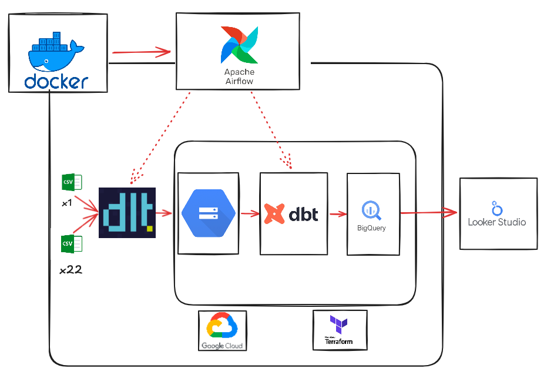
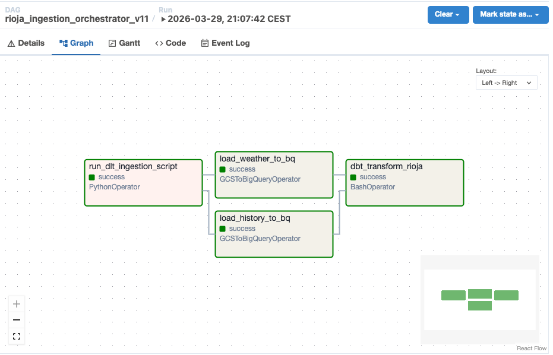
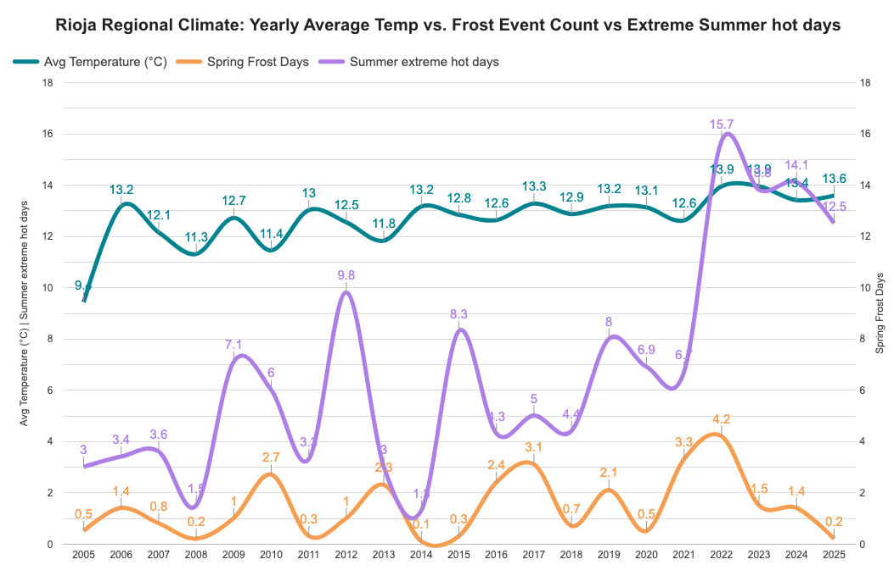
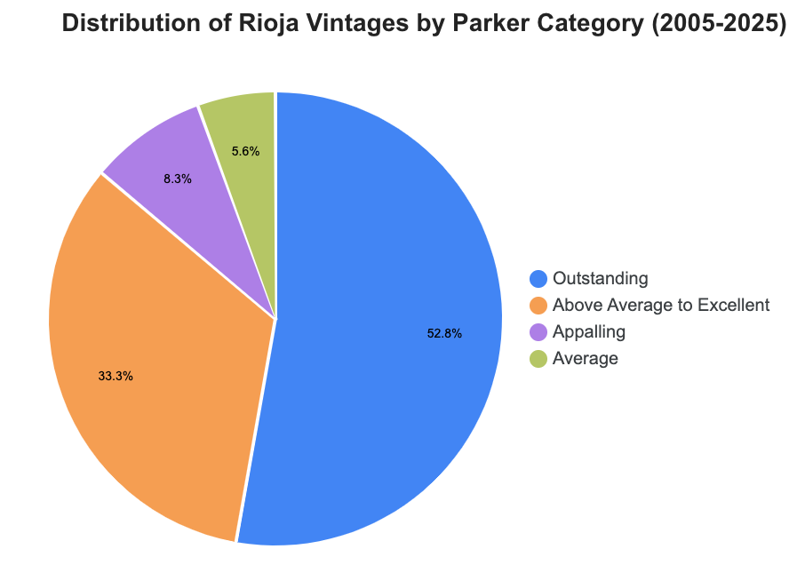

# Rioja Wine & Climate Analytics Pipeline


## Project Description
This project focuses on the intersection of **Viticulture and Climate Change**. It analyzes over 20 years of daily weather data from the Rioja region (Spain) across 22 data stations to understand how thermal stress (frost and heatwaves) affects wine quality.

**The Problem:** Rioja winemakers face increasing climate volatility. While average temperatures rise, late spring frosts still threaten budding vines.
**The Solution:** An automated end-to-end pipeline that ingests, transforms, and visualizes daily weather metrics and historical vintage scores to provide actionable climate insights.


## Data Sources

This project integrates two primary datasets:
* **Climate Data:** Sourced from **SIAR (Sistema de Información Agroclimática para el Regadío)**. It includes 21 years of daily records (min/max temperature, precipitation,etc) from 22 regional weather stations across the Rioja wine territory. Joined and ingested together on the dtl scrypt.
* **Vintage Quality:** Sourced from **DOCa Rioja** (Consejo Regulador de la Denominación de Origen Calificada Rioja) and historical **Parker Ratings**, providing yield metrics and qualitative scores for each vintage since 2002.


## Architecture

The project follows a **Medallion Architecture** managed by a modern data stack:




* **Infrastructure (IaC):** **Terraform** for provisioning Google Cloud Storage and BigQuery.
* **Orchestration:** **Apache Airflow** (Dockerized) managing the workflow.
* **Ingestion (ELT):** **dlt (Data Load Tool)** for robust ingestion of 23 CSV sources.
* **DataLake:** **Google Storage** (GS) in GCP.
* **Data Warehouse:** **Google BigQuery** (Storage & Compute).
* **Transformation:** **dbt (data build tool)** for SQL modeling and business logic.
* **Visualization:** **Looker Studio** for the final analytical dashboards.

### Docker Architecture & Dual Images
This project utilizes **two specialized Docker images** to ensure a clear separation of concerns between data processing logic and pipeline orchestration.

**Why two Dockerfiles?**
Instead of using a monolithic image, I follow a decoupled approach:

**Dockerfile (Data Logic & Processing):**

* Purpose: Contains the core Data Engineering stack (dlt, dbt, pandas).

* Role: Used for local development, testing ingestion scripts (dlt_data_ingestion.py), and running transformation models independently.

* Base: python:3.12-slim for a lightweight, high-performance execution environment.

**Dockerfile.airflow (Orchestration):**

* Purpose: Extends the official apache/airflow image.

* Role: Manages the Airflow Scheduler, Webserver, and Workers.

* Key Integration: Includes the necessary GCP providers and system-level dependencies required to trigger the data logic and manage BigQuery connections from the DAGs.

* This setup ensures that the orchestration layer remains stable while the data processing environment can be updated or scaled independently.

**Orchestration: The docker-compose.yml**
* The docker-compose.yml file acts as the central orchestrator, defining how the different services interact, share volumes, and connect to the network. Instead of running containers manually, this file allows the entire stack to be launched with a single command: docker-compose up -d.

###  Dependency Management
I use a **decoupled dependency strategy**:

* **Core Logic (`pyproject.toml`):** Managed by `uv`. It includes `dlt`, `dbt-bigquery`, and `pandas`. This environment is used for local development and data processing tasks.
* **Orchestration (`Dockerfile.airflow`):** Airflow is managed as part of the infrastructure. We use the official Apache Airflow Docker image to avoid dependency conflicts with the data transformation stack.

---
## Project Structure


The repository is organized to separate infrastructure, orchestration, and data transformation logic:

```text
.
├── airflow/                  # Orchestration layer (Airflow configuration)
│   └── dags/
│       └── rioja_wine_elt.py # Airflow DAG defining the pipeline task flow
├── readme_images/            # Documentation assets (Architecture, DAG, Charts)
├── rioja_data/               # Source dataset (23 CSV files with weather & vintage data)
├── rioja_dbt/                # Transformation layer (dbt)
│   ├── models/
│   │   ├── staging/          # Silver layer: Cleaning and type casting
│   │   └── marts/            # Gold layer: fct_weather_trends logic
│   ├── dbt_project.yml       # dbt configuration
│   └── packages.yml          # dbt dependencies (dbt_utils)
├── terraform/                # Infrastructure as Code (GCP)
│   ├── main.tf               # GCS and BigQuery resource definitions
│   └── variables.tf          # GCP Project and Region variables
├── .gitignore                # Ensures credentials and local venv are not pushed
├── .python-version           # Managed by uv (e.g., 3.12)
├── Dockerfile                # Custom image for the pipeline environment
├── Dockerfile.airflow        # Specialized image for the Airflow services
├── dlt_data_ingestion.py     # Main ingestion script using dlt (Python)
├── docker-compose.yml        # Multi-container setup for Airflow, DB, and Workers
├── pyproject.toml            # Project dependencies and tool configuration (uv)
├── uv.lock                   # Deterministic lockfile for Python dependencies
├── google_credentials.json   # (Local only) GCP Service Account Key
└── README.md                 # Project documentation
```
##  Data Pipeline Details

### 1. Orchestration (Apache Airflow)
The data lifecycle is managed by an Airflow DAG that ensures a strict execution order:
* **Task Dependencies:** The pipeline first triggers the `dlt` ingestion task. Only upon successful completion does it trigger the `dbt` transformation models.
* **Monitoring:** The Airflow UI provides real-time logs and health checks, ensuring that any data loading errors are caught and handled via retries.




### 2. Ingestion (dlt - Data Load Tool)
The ingestion layer leverages the `dlt` library to move data from local CSVs to the cloud:
* **Sources:** 23 CSV files, including one historical vintage record and 22 yearly files of daily weather station data.
* **Schema Evolution:** `dlt` automatically infers schemas and enforces data types, ensuring a structured load into **Bronze (Raw)** tables in BigQuery.
* **Efficiency:** Handles file flattening and normalization without manual SQL DDL commands.

### 3. Transformation (dbt - Data Build Tool)
Raw data is refined through a tiered modeling approach:
* **Staging Layer (Silver):** Cleans field names, casts data types, and filters out incomplete records (e.g., excluding 2026 data).
* **Analytics Layer (Gold - `fct_weather_trends`):** This model solves the "station duplication" challenge. It first calculates metrics per weather station and then averages them to provide a representative regional value.
* **Custom Business Logic:** 
    * **Spring Frost:** Days where $temp\_min \le 0°C$ during budding months (April–June).
    * **Extreme Heat:** Days where $temp\_max \ge 35°C$ during ripening months (July–August).

---
##  Dashboard & Key Insights

 **Thermal Stress Analysis** 

 
[ Access the Dashboard via Looker Studio](https://lookerstudio.google.com/s/jguRo6B6bsg)

**Vintage Quality (Parker Scale)** |
  
 [ Access the Dashboard via looker studio](https://lookerstudio.google.com/s/h7uvH030hrw)

**Key Findings:**
1.  **Warming Trend:** A clear upward slope in average annual temperatures since 2005.
2.  **Climatic Volatility:** Despite general warming, specific years like 2022 show record peaks in frost days, proving that "average" warming does not eliminate local cold risks.
3.  **Quality Resilience:** Over 60% of Rioja vintages remain in high-quality categories ("Excellent"/"Very Good") despite increasing heat stress.

---
##  How to Reproduce (Step-by-Step)

Follow these instructions to replicate the entire pipeline from infrastructure provisioning to final data visualization.

### 1. Prerequisites
Ensure you have the following tools installed on your local machine:
* **Docker & Docker Compose** (Desktop or Engine)
* **Terraform** (v1.0 or higher)
* **Google Cloud SDK** (`gcloud` CLI)
* A **Google Cloud Platform (GCP)** account with an active project.

### 2. Google Cloud Setup (IAM & Authentication)
Before running the code, you must authorize the pipeline to interact with your GCP account:
1.  **Create a Service Account:** Navigate to `IAM & Admin > Service Accounts` in your GCP Console.
2.  **Assign Permissions:** Grant the following roles to the service account:
    * `Storage Admin` (to manage the GCS Bucket).
    * `BigQuery Admin` (to manage datasets, tables, and transformations).
3.  **Generate JSON Key:** Create a new JSON key for this service account, download it, and rename it to `google_credentials.json`.
4.  **Security:** Place the `google_credentials.json` file in the **root directory** of this project. 
    * *Note: The `.gitignore` file is pre-configured to ensure this file is never pushed to GitHub.*

### 3. Infrastructure as Code (Terraform)
Initialize and deploy the cloud resources (GCS Bucket for raw files and BigQuery for the Data Warehouse):
```bash
cd terraform
terraform init
terraform apply
```

### 4. Launching the Environment (Docker & Airflow)
Return to the root directory and start the containerized services:
```bash
cd ..
docker-compose up -d
```
**This command spins up the following services:**

- **PostgreSQL**: Airflow metadata database.
- **Airflow Webserver/Scheduler**: accessible at `http://localhost:8080`.
- **dbt / dlt**: pre-installed within the Airflow environment for execution.

### 5. Running the Data Pipeline
The pipeline is designed to be fully automated. 

#### Airflow Web UI (Visual Monitoring)
- **Access:** Open the Airflow UI at `http://localhost:8080`, I was running the project in a GCP instance, so I use the external I.P of the instance as 'localhost'
- **Login:** Default credentials are user: `admin` / password: `admin`.
- **Unpause the DAG:** Locate the `rioja_ingestion_orchestrator_v11` DAG and toggle the switch to On.
- **Trigger:** Click the Play button to start the pipeline.
- **Tip:** Use the Graph View to monitor dlt ingesting the 23 CSV files followed by the dbt transformation models.

### 6. Verify and Visualize
- **BigQuery:** Visit your Google Cloud Console. You will see your data organized into three schemas: `rioja_bronze` (raw data), `rioja_silver` (staged/cleaned), and `rioja_gold` (analytical marts).
- **Dashboard:** Open Looker Studio and connect to the `fct_weather_trends` table in your `rioja_gold` dataset to view the final climate report, and to the `stg_rioja_history` to the parker pie chart

### 7. Cleaning Up
- To avoid incurring unnecessary charges on GCP after testing, remember to destroy the infrastructure:

```bash
# Stop Docker containers
docker-compose down

# Destroy GCP resources
cd terraform
terraform destroy
```

---
##  Future Roadmap & ML Integration
The current architecture provides a robust foundation for historical analysis. The next phase focuses on real-time intelligence and predictive modeling by integrating live agricultural data.

#### 1. SIAR API Integration (Continuous Ingestion)
- **Automated Data Fetching:** Replace manual CSV uploads with a dlt verified source that pulls daily weather and soil moisture data.
- **Continuous Evaluation:** Monitor real-time climate deviations against the historical Rioja datasets.

#### 2. Machine Learning Pipeline
By leveraging the cleaned data in BigQuery, we aim to implement the following ML use cases:
- **Harvest Date Prediction:** A regression model (e.g., XGBoost or Vertex AI AutoML) to predict the optimal harvest window based on accumulated thermal heat and precipitation patterns.
- **Smart Irrigation Profiles:** Using soil sensors and ET0 (Evapotranspiration) data to suggest precise irrigation schedules, optimizing water usage in the vineyards.
- **Disease Risk Assessment:** Early warning systems for vineyard diseases (like Mildew or Oidium) based on humidity and temperature thresholds.

#### 3. Advanced Analytics
- **Vertex AI Integration:** Deploy models directly from the BigQuery environment using BigQuery ML.
- **Real-time Alerts:** Configure Airflow to send Slack or Email notifications when climate sensors hit critical thresholds for the vines.

This project is designed to be the backbone of a data-driven viticulture ecosystem. 